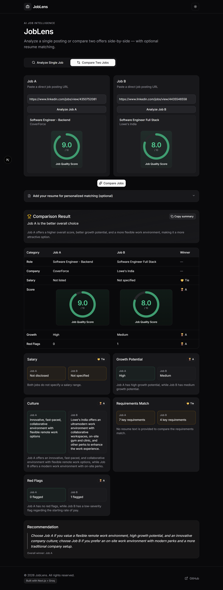

# JobLens

JobLens is an AI-powered job posting analyzer. Paste a URL from LinkedIn, Greenhouse, Lever, Workday, or other supported boards to extract requirements, culture signals, red flags, and an overall quality score. Optionally paste your resume for a match score and gap analysis.

[Live Link](https://joblens-dusky.vercel.app/)



> **Screenshot placeholder:** Add `docs/screenshot.png` after capturing the home page and an analysis result.

## Tech stack

- **Framework:** [Next.js 16](https://nextjs.org) (App Router, TypeScript)
- **UI:** [Tailwind CSS 4](https://tailwindcss.com), [shadcn/ui](https://ui.shadcn.com), [Lucide](https://lucide.dev) icons
- **AI:** [Groq](https://groq.com) (`llama-3.3-70b-versatile` with fallback model)
- **Validation:** [Zod](https://zod.dev)
- **Scraping:** `fetch` + [Cheerio](https://cheerio.js.org) (server-side in `/api/analyze`)
- **Theming:** [next-themes](https://github.com/pacocoursey/next-themes) (light / dark)

## Local setup

### Prerequisites

- Node.js 20+ (22 LTS recommended)
- npm 10+
- A [Groq API key](https://console.groq.com/keys)

### Steps

1. **Clone and enter the project**

   ```bash
   git clone <https://github.com/suthakaranburaj/joblens.git>
   cd joblens
   ```

2. **Install dependencies**

   ```bash
   npm install
   ```

3. **Configure environment**

   ```bash
   cp .env.example .env.local
   ```

   Edit `.env.local` and set `GROQ_API_KEY` to your real key.

4. **Run the dev server**

   ```bash
   npm run dev
   ```

   Open [http://localhost:3000](http://localhost:3000).

5. **Production build (optional check)**

   ```bash
   npm run build
   npm run start
   ```

## Environment variables

| Variable        | Required | Description                                      |
|-----------------|----------|--------------------------------------------------|
| `GROQ_API_KEY`  | Yes      | Groq API key for job analysis (server-side only) |

See `.env.example` for commented templates. Never commit `.env.local` or real keys.

## Scripts

| Command         | Description                          |
|-----------------|--------------------------------------|
| `npm run dev`   | Start development server             |
| `npm run build` | Production build                     |
| `npm run start` | Start production server              |
| `npm run lint`  | Run ESLint                           |

## Deployment (Vercel)

1. Push the repo to GitHub.
2. Import the project in [Vercel](https://vercel.com/new).
3. Set **Root Directory** to `joblens` if the repo root is the monorepo folder; otherwise use repo root.
4. Add environment variable:
   - `GROQ_API_KEY` = your Groq key (Production + Preview as needed)
5. Deploy. Vercel detects Next.js automatically.

**Notes:**

- `/api/analyze` uses the Node.js runtime (Cheerio). Vercel serverless functions support this.
- In-memory rate limiting resets per server instance; use Redis/KV for strict global limits in production at scale.
- `output: "standalone"` in `next.config.js` helps Docker/VM deploys; Vercel ignores it for its own build pipeline.

### Docker (optional, standalone)

After `npm run build`:

```bash
node .next/standalone/server.js
```

Copy `public` and `.next/static` into the standalone folder per [Next.js standalone docs](https://nextjs.org/docs/app/api-reference/config/next-config-js/output).

## Project structure (high level)

```
app/              App Router pages and /api/analyze
components/       UI, layout, and feature components
hooks/            useAnalysis and page effects
lib/              Groq service, utils (scrape, validate, log)
types/            Shared TypeScript types
providers/        Theme provider
```

## License

Private / assignment project — update as needed.
